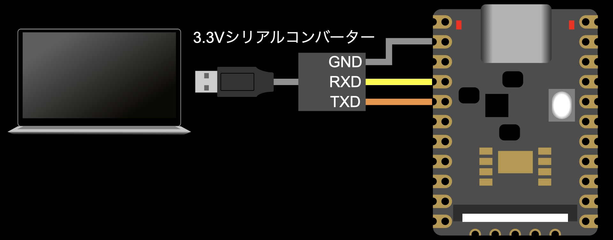
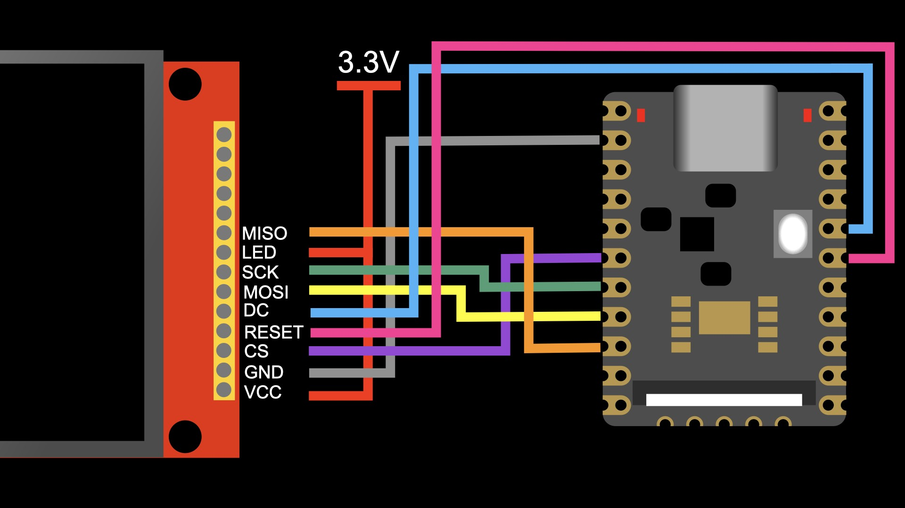
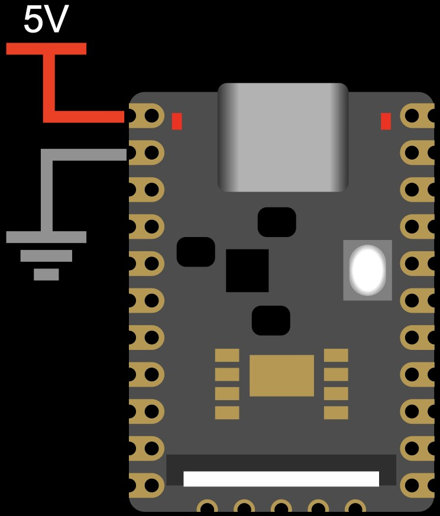

# Luckfox Pico MiniでGentooを動かす手順

## 用意する物

### Luckfox Pico Mini

これ https://www.luckfox.com/Luckfox-Pico/Luckfox-Pico-Mini-A

公式サイトから買うよりAliExpressでセールしている時に買う方が安い

ボードの側面から出ている2.54mmピッチのスルーホールにシリアル変換ケーブルを繋ぐ必要がある

簡単なのはスルーホールにピンヘッダを半田付けしてブレッドボードにさす方法

自分で半田付けできる気がしない人は最初からピンヘッダが半田付けされている物を買うと良い

### 3.3VのUSBシリアル変換ケーブル

例えばこういうの https://akizukidenshi.com/catalog/g/g105840/

### x86\_64 でLinuxが動くホスト

一部の必要なツールがx86\_64でないと動かないのでx86\_64が必須

別途armv7aまたはarmv8aでLinuxが動く速いホストがあると環境構築にqemuを使う必要がなくなり捗る

### 32GB以上のMicroSDカード

x86\_64またはarmのホストから読み書きする必要がある為、これらのホストにMicroSDカードスロットが無い場合はUSB接続のSDカードリーダーを用意する

### USB Type-Cまたはボード側面のスルーホールから5Vを供給する手段

簡単なのはこういうの https://akizukidenshi.com/catalog/g/g114935/

RaspberryPi 4または5向けに作られたACアダプタが余っている場合はそれでも良い

ボード側面のスルーホールから5Vを入れるとUSB端子が空いてUSB接続の周辺機器を繋ぐ為に使えるようになる

こういうのを使うとUSB Type-CのACアダプタからの電源をブレッドボードで好きなピンに配線できるようになる

https://akizukidenshi.com/catalog/g/g113080/

## MicroSDのパーティションを切る

MicroSDを読み書きできるホスト(x86\_64でもarmでも良い)にMicroSDカードをさしてdmesgで割り当てられたデバイスファイルの名前を確認する

```
$ dmesg
...
[808902.936106] [T1645045] usb 4-2.2: new SuperSpeed USB device number 7 using xhci_hcd
[808902.949902] [T1645045] usb 4-2.2: New USB device found, idVendor=11b0, idProduct=3307, bcdDevice= 0.13
[808902.949906] [T1645045] usb 4-2.2: New USB device strings: Mfr=3, Product=4, SerialNumber=2
[808902.949909] [T1645045] usb 4-2.2: Product: UHSII uSD Reader
[808902.949911] [T1645045] usb 4-2.2: Manufacturer: Kingston
[808902.949912] [T1645045] usb 4-2.2: SerialNumber: 202006007839
[808902.950670] [T1645045] usb-storage 4-2.2:1.0: USB Mass Storage device detected
[808902.950810] [T1645045] scsi host0: usb-storage 4-2.2:1.0
[808903.957309] [T1644897] scsi 0:0:0:0: Direct-Access     Kingston UHSII uSD Reader 0013 PQ: 0 ANSI: 6
[808905.093059] [T1644890] sd 0:0:0:0: [sda] 62309376 512-byte logical blocks: (31.9 GB/29.7 GiB)
[808905.093703] [T1644890] sd 0:0:0:0: [sda] Write Protect is off
[808905.093707] [T1644890] sd 0:0:0:0: [sda] Mode Sense: 21 00 00 00
[808905.094289] [T1644890] sd 0:0:0:0: [sda] Write cache: disabled, read cache: enabled, doesn't support DPO or FUA
[808905.187398] [T1644890]  sda: sda1
[808905.187471] [T1644890] sd 0:0:0:0: [sda] Attached SCSI removable disk
...
```

例えば上のようなログが出ていた場合MicroSDは/dev/sdaを通してアクセスできるようになっている

SATAのハードディスクやSSDが繋がっているホストではそれらも/dev/sd*という名前が割り当てられている

これから行う操作はストレージに既に書かれている内容を破壊するので対象のストレージを間違えないように必ず確認を行う事

使っているLinuxディストリによっては一般ユーザではdmesgが蹴られる事がある

```
$ dmesg
dmesg: カーネルバッファの読み込みに失敗しました: 許可されていない操作です
```

上のようなメッセージが出る場合はsudo dmesgで確認する

以降MicroSDのデバイスファイル名は${SDCARD}と呼べるようにしておく

```
$ export SDCARD=sda # sdaじゃなかった場合はsdaの部分を書き換える
```

ここからの操作はrootで行う

fdiskを使ってMicroSDカードのパーティションを切る

```
$ fdisk /dev/${SDCARD}

fdisk (util-linux 2.41.3) へようこそ。
ここで設定した内容は、書き込みコマンドを実行するまでメモリのみに保持されます。
書き込みコマンドを使用する際は、注意して実行してください。


コマンド (m でヘルプ): o
新しい DOS (MBR) ディスクラベルを作成しました。識別子は 0x2ee1d954 です。

コマンド (m でヘルプ): n
パーティションタイプ
   p   基本パーティション (0 プライマリ, 0 拡張, 4 空き)
   e   拡張領域 (論理パーティションが入ります)
選択 (既定値 p): p
パーティション番号 (1-4, 既定値 1): 1
最初のセクタ (2048-62309375, 既定値 2048): 32768
最終セクタ, +/-セクタ番号 または +/-サイズ{K,M,G,T,P} (32768-62309375, 既定値 62309375): 227327

新しいパーティション 1 をタイプ Linux、サイズ 95 MiB で作成しました。

コマンド (m でヘルプ): n
パーティションタイプ
   p   基本パーティション (1 プライマリ, 0 拡張, 3 空き)
   e   拡張領域 (論理パーティションが入ります)
選択 (既定値 p): p
パーティション番号 (2-4, 既定値 2): 2
最初のセクタ (2048-62309375, 既定値 2048): 227328
最終セクタ, +/-セクタ番号 または +/-サイズ{K,M,G,T,P} (227328-62309375, 既定値 62309375): 16875519

新しいパーティション 2 をタイプ Linux、サイズ 7.9 GiB で作成しました。

コマンド (m でヘルプ): n
パーティションタイプ
   p   基本パーティション (2 プライマリ, 0 拡張, 2 空き)
   e   拡張領域 (論理パーティションが入ります)
選択 (既定値 p): p
パーティション番号 (3,4, 既定値 3): 3
最初のセクタ (2048-62309375, 既定値 2048): 16875520
最終セクタ, +/-セクタ番号 または +/-サイズ{K,M,G,T,P} (16875520-62309375, 既定値 62309375): 

新しいパーティション 3 をタイプ Linux、サイズ 21.7 GiB で作成しした。

コマンド (m でヘルプ): t
パーティション番号 (1-3, 既定値 3): 2
16 進数コード または別名 (L で利用可能なコードを一覧表示します): 82

パーティションのタイプを 'Linux' から 'Linux swap / Solaris' に変更しました。

コマンド (m でヘルプ): a
パーティション番号 (1-3, 既定値 3): 1

パーティション 1 の起動フラグを有効にしました。

コマンド (m でヘルプ): p
ディスク /dev/${SDCARD}: 29.71 GiB, 31902400512 バイト, 62309376 セクタ
ディスク型式: UHSII uSD Reader
単位: セクタ (1 * 512 = 512 バイト)
セクタサイズ (論理 / 物理): 512 バイト / 512 バイト
I/O サイズ (最小 / 推奨): 512 バイト / 512 バイト
ディスクラベルのタイプ: dos
ディスク識別子: 0x90438913

デバイス   起動 開始位置 終了位置   セクタ サイズ Id タイプ
/dev/${SDCARD}1  *       32768   227327   194560    95M 83 Linux
/dev/${SDCARD}2         227328 16875519 16648192   7.9G 82 Linux スワップ / Solaris
/dev/${SDCARD}3       16875520 62309375 45433856  21.7G 83 Linux

コマンド (m でヘルプ): w
パーティション情報が変更されました。
ioctl() を呼び出してパーティション情報を再読み込みします。
ディスクを同期しています。
```

1つ目のパーティションはu-boot(ブートローダー)が読む為の物でu-bootの設定とLinuxカーネルを置く

2つ目のパーティションはLinuxがスワップ領域として使う

3つ目のパーティションはLinuxがルートファイルシステムとして使う

重要なポイントは3点

* パーティションテーブルをdos形式(MBR)にする

u-boot(ブートローダー)とLinuxカーネルを小さくする為にdos形式のパーティションテーブルだけを読める設定でビルドするので、そのままの設定ではGPT形式のパーティションテーブルが読めない

どうしてもGPT形式を使いたい場合はu-bootとカーネルのconfigを変更する

* 最初のパーティションの前に32767セクタの空き領域を作る

この部分にu-bootを書き込む

* スワップ領域を作る

Luckfox Pico Miniにはメモリが64MBしかないので、何を動かすにしても「スワップを使って耐える」のが基本になる


## ファイルシステムを作る

以下の手順はMicroSDを読み書きできるホスト(x86\_64でもarmでも良い)にMicroSDカードをさしてrootで行う

まず1つ目のパーティションをFAT32でフォーマットする

```
$ mkfs.vfat -F 32 /dev/${SDCARD}1
mkfs.fat 4.2 (2021-01-31)
```

2つ目のパーティションをスワップ領域として使えるようにする

```
$ mkswap /dev/${SDCARD}2
スワップ空間バージョン 1 を設定します。サイズ = 7.9 GiB (8523870208 バイト)
ラベルはありません, UUID=4af8b508-ac66-443e-bc1c-e88eacfa5173
```

3つ目のパーティションをフラッシュメモリいたわりファイルシステムf2fsでフォーマットする

```
$ mkfs.f2fs -O extra_attr,inode_checksum,sb_checksum,encrypt,compression /dev/${SDCARD}3

    F2FS-tools: mkfs.f2fs Ver: 1.16.0 (2023-04-11)

Info: Disable heap-based policy
Info: Debug level = 0
Info: Trim is enabled
Info: Enable Compression
Info: [/dev/${SDCARD}3] Disk Model: UHSII uSD Reader
Info: Segments per section = 1
Info: Sections per zone = 1
Info: sector size = 512
Info: total sectors = 45433856 (22184 MB)
Info: zone aligned segment0 blkaddr: 512
Info: format version with
  "Linux version 6.18.18-gentoo (root@spica) (gcc (Gentoo 14.3.1_p20260213 p5) 14.3.1 20260213, GNU ld (Gentoo 2.46.0 p1) 2.46.0) #5 SMP PREEMPT Wed Apr  8 16:33:52 JST 2026"
Info: [/dev/${SDCARD}3] Discarding device
Info: This device doesn't support BLKSECDISCARD
Info: This device doesn't support BLKDISCARD
Info: Overprovision ratio = 0.990%
Info: Overprovision segments = 110 (GC reserved = 108)
Info: format successful
```

u-bootはFATだけ、LinuxカーネルはFATとf2fsだけを読み書きできる設定でビルドするので、これ以外のファイルシステムを使いたい場合はu-bootとカーネルのconfigを変更する必要がある

## u-bootをビルドする

以下の手順はMicroSDを読み書きできる **x86\_64の** ホストにMicroSDカードをさして行う

Luckfox Pico MiniのSoC RV1103でu-bootを動かす為に必要なコードは本家のu-bootに入っていない

この為Luckfox Pico SDKに入っているu-bootのソースを使う必要がある

このu-bootは2017年頃のu-bootからforkしている為、Standard Bootのようなイマドキのブート方法は使えない

Luckfox Pico SDKのu-bootはそのままだとu-boot自体はパーティションを解さず、MicroSDの特定の位置からロードしたカーネルにblkdevparts形式のパーティションテーブルを渡すようになっている

この方式だとMicroSDを他のホストから読んだ時にパーティションテーブルが見えず、各パーティションをマウントするのが面倒なので、FATのサポートとdos形式のパーティションテーブルのサポートをu-bootに突っ込んでカーネルをFATから読めるようにすると共に他のホストからMicroSDを見た時にパーティションテーブルが見えるようにする

Luckfox Pico SDKはあらかじめ用意した設定ファイルを使ってu-bootを設定してビルドするようになっているので、新しい設定ファイルを作ってそちらを使うようにするパッチを当てる

```
$ cd ${WORKDIR}
$ git clone --depth 1 https://github.com/LuckfoxTECH/luckfox-pico.git
$ git clone --depth 1 https://github.com/Fadis/gentoo_on_luckfox_pico_mini.git
$ cd luckfox-pico/
$ patch -p1 <../gentoo_on_luckfox_pico_mini/usr/src/luckfox-pico-sdk.diff 
patching file project/cfg/BoardConfig_IPC/BoardConfig-SD_CARD-Buildroot-RV1103_Luckfox_Pico_Mini-IPC.mk
patching file sysdrv/source/uboot/u-boot/arch/arm/dts/rv1106-u-boot.dtsi
patching file sysdrv/source/uboot/u-boot/common/image.c
patching file sysdrv/source/uboot/u-boot/configs/luckfox_rv1106_uboot_custom_defconfig
patching file sysdrv/source/uboot/u-boot/scripts/kconfig/lxdialog/check-lxdialog.sh
```

Luckfox Pico SDKのbuild.shを使ってubootだけビルドする

```
$ ./build.sh uboot
You're building on Linux
  Lunch menu...pick the Luckfox Pico hardware version:
  选择 Luckfox Pico 硬件版本:
                [0] RV1103_Luckfox_Pico
                [1] RV1103_Luckfox_Pico_Mini
                [2] RV1103_Luckfox_Pico_Plus
                [3] RV1103_Luckfox_Pico_WebBee
                [4] RV1106_Luckfox_Pico_Pro_Max
                [5] RV1106_Luckfox_Pico_Ultra
                [6] RV1106_Luckfox_Pico_Pi
                [7] RV1106_Luckfox_Pico_86Panel
                [8] RV1106_Luckfox_Pico_Zero
                [9] custom
Which would you like? [0~9][default:0]: 1
  Lunch menu...pick the boot medium:
  选择启动媒介:
                [0] SD_CARD
                [1] SPI_NAND
Which would you like? [0~1][default:0]: 0
  Lunch menu...pick the system version:
  选择系统版本:
                [0] Buildroot 
Which would you like? [0][default:0]: 
[build.sh:info] Lunching for Default BoardConfig_IPC/BoardConfig-SD_CARD-Buildroot-RV1103_Luckfox_Pico_Mini-IPC.mk board
s...                                                                                                                    
[build.sh:info] switching to board: /home/fadis/lf/luckfox-pico/project/cfg/BoardConfig_IPC/BoardConfig-SD_CARD-Buildroo
t-RV1103_Luckfox_Pico_Mini-IPC.mk
[build.sh:info] switch to DTS: /home/fadis/lf/luckfox-pico/sysdrv/source/kernel/arch/arm/boot/dts/rv1103g-luckfox-pico-m
ini.dts                                                                                                                 
[build.sh:info] switch to kernel defconfig: /home/fadis/lf/luckfox-pico/sysdrv/source/kernel/arch/arm/configs/luckfox_rv
1106_linux_defconfig                                        
[build.sh:info] use " ./build.sh buildrootconfig" to create buildroot_defconfig
**************************************                                                                                  
Check [OK]: dtc --version                                   
**************************************                                                                                  
Check [OK]: makeinfo --version 
**************************************
Check [OK]: gperf --version
**************************************
Please install dpkg first
    sudo apt-get install  g++-multilib
**************************************
Please install dpkg first
    sudo apt-get install  gcc-multilib
**************************************
Check [OK]: make -v
GLOBAL_PARTITIONS: 0x8000@0x0(env),0x80000@0x8000(idblock),0x40000@0x88000(uboot),0x2000000@0xC8000(boot),0x10000000@0x2
0C8000(userdata),-@0x120C8000(rootfs)
[build.sh:info] Partition Filesystem Type Configure: rootfs@IGNORE@ext4,userdata@/userdata@ext4
============Start building uboot============
TARGET_UBOOT_CONFIG=luckfox_rv1106_uboot_custom_defconfig rk-emmc.config
=========================================
make: Entering directory '/home/fadis/lf/luckfox-pico/sysdrv'
 ==sysdrv== build uboot  
  HOSTCC  scripts/basic/fixdep 
  HOSTCC  scripts/kconfig/conf.o
...
  FDT:          fdt
  Loadables:    uboot
********boot_merger ver 1.35********
Info:Pack loader ok.
creating new idblock from loader...
idblock binary saving at rv1106_idblock_v1.15.102.img
pack loader(SPL) okay! Input: /usr/src/rockchip/luckfox-pico/sysdrv/source/uboot/rkbin/RKBOOT/RV1106MINIALL.ini

/usr/src/rockchip/luckfox-pico/sysdrv/source/uboot/u-boot
pack loader with new: spl/u-boot-spl.bin

Image(no-signed, version=0): uboot.img (FIT with uboot, trust...) is ready
Image(no-signed): rv1106_idblock_v1.15.102.img (with spl, ddr...) is ready
pack uboot.img okay! Input: /usr/src/rockchip/luckfox-pico/sysdrv/source/uboot/rkbin/RKTRUST/RV1106TOS.ini

Platform RV1106 is build OK, with exist .config
arm-rockchip830-linux-uclibcgnueabihf-
Sat Apr 18 02:05:48 JST 2026
/usr/src/rockchip/luckfox-pico/sysdrv
'/usr/src/rockchip/luckfox-pico/sysdrv/source/uboot/u-boot/uboot.img' -> '/usr/src/rockchip/luckfox-pico/sysdrv/out/image_uclibc_rv1106/uboot.img'
'/usr/src/rockchip/luckfox-pico/sysdrv/source/uboot/u-boot/rv1106_idblock_v1.15.102.img' -> '/usr/src/rockchip/luckfox-pico/sysdrv/out/image_uclibc_rv1106/idblock.img'
'/usr/src/rockchip/luckfox-pico/sysdrv/source/uboot/u-boot/rv1106_download_v1.15.108.bin' -> '/usr/src/rockchip/luckfox-pico/sysdrv/out/image_uclibc_rv1106/download.bin'
/usr/src/rockchip/luckfox-pico/sysdrv/source/uboot/u-boot /usr/src/rockchip/luckfox-pico/sysdrv
/usr/src/rockchip/luckfox-pico/sysdrv


 [INSTALL]  /usr/src/rockchip/luckfox-pico/sysdrv/out/image_uclibc_rv1106/idblock.img /usr/src/rockchip/luckfox-pico/sysdrv/out/image_uclibc_rv1106/uboot.img /usr/src/rockchip/luckfox-pico/sysdrv/out/image_uclibc_rv1106/download.bin 
    TO      /usr/src/rockchip/luckfox-pico/output/image 


 [INSTALL]  /usr/src/rockchip/luckfox-pico/sysdrv/out/bin/board_uclibc_rv1106/uboot.debug.tar.bz2 
    TO      /usr/src/rockchip/luckfox-pico/output/out/sysdrv_out/board_uclibc_rv1106 


make: Leaving directory '/usr/src/rockchip/luckfox-pico/sysdrv'
[build.sh:info] Running build_uboot succeeded.

```

Luckfox Pico MiniのSoC RV1103は起動するとまずSoC内のブートROMのコードが実行される

ブートROMのコードはMicroSD等の接続されているストレージの64セクタ目に専用のヘッダが書かれているのを見つけると、その後ろに書かれている内容をメモリにロードして実行する

この段階ではDRAMコントローラの設定がなされていない

Rockchip社製のSoCではいつもの流れだが、このDRAMコントローラの設定は rkbin で配布されているバイナリファームウェアが行う

https://github.com/rockchip-linux/rkbin

rkbinはLuckfox Pico SDKに同梱されている為別途cloneする必要はない

ファームウェアはDRAMコントローラの設定が完了すると自身の後ろにくっついているペイロードをDRAMにロードして実行する

このペイロードにはサイズ制限があるらしく、u-bootを動かす場合u-boot SPLが使われる

(本当に制限があるかは謎だがLuckfox Pico Miniの公式のイメージがそういうブート方法になっていたので合わせた)

u-boot SPLはu-bootをロードするための小さいブートローダーで、プラットフォームのファームウェアの制約によりu-bootを直接ロードできない場合に使われる

まとめるとブートの流れは以下のようになる

```
[ブートROM] -> [rkbinのファームウェア] -> [u-boot SPL] -> [u-boot] -> [Linuxカーネル]
```

このうちrkbinのファームウェアとu-boot SPLはブートROMが解釈する形式のヘッダを付けて1つのイメージに固められている必要がある

build.sh ubootではこのイメージを作る為にu-bootのビルドが終わった後でboot\_mergerを実行している

boot\_mergerはrkbinのファームウェアとu-boot SPLをくっつけてヘッダを追加してブートROMが読めるイメージにするが、これが **x86\_64の実行可能バイナリ** の状態でrkbinの中に突っ込まれている

この為build.sh ubootはx86\_64のホストで実行しなければならない

ビルドが完了するとluckfox-pico/output/image/にidblock.imgとuboot.imgができている

```
$ ls -hs output/image/
合計 648K
264K download.bin  184K idblock.img  200K uboot.img
```
idblock.imgがファームウェアとu-boot SPLをくっつけたイメージ、uboot.imgがu-boot本体

これをddでSDカードの適切な位置に書き込む

```
$ dd if=output/image/idblock.img of=/dev/${SDCARD} seek=64
364+0 レコード入力
364+0 レコード出力
186368 バイト (186 kB, 182 KiB) コピーされました、 0.0294244 s, 6.3 MB/s
$ dd if=output/image/uboot.img of=/dev/${SDCARD} seek=1024
512+0 レコード入力
512+0 レコード出力
262144 バイト (262 kB, 256 KiB) コピーされました、 0.0340959 s, 7.7 MB/s
```

idblock.imgはブートROMに見つけてもらう為に64セクタ目に書く必要がある

u-boot.imgをMicroSDの何セクタ目からロードするかはu-bootのビルドの設定で指定できる

上のパッチで追加した設定では0x400(=1024)セクタ目を指定してあるので、そこにu-boot.imgを書き込む



この時点のMicroSDをLuckfox Pico Miniに差し込み、図のようにシリアルコンバーターを接続して電源を入れ、ボーレート でシリアルを眺めていると以下のようなログが流れてくる

```
DDR 306b9977f5 wesley.yao 23/12/21-09:28:37,fwver: v1.15
S5P1
4x
fc27
rgef0
rgef1
DDRConf1
DDR2, BW=16 Col=10 Bk=4 CS0 Row=13 CS=1 Size=64MB
528MHz
DDR bin out

U-Boot SPL board init
U-Boot SPL 2017.09 (Apr 18 2026 - 02:05:47)
unknown raw ID 0 0 0
Trying to boot from MMC2
spl: partition error
Trying fit image at 0x400 sector
## Verified-boot: 0
## Checking uboot 0x00200000 (gzip @0x00400000) ... sha256(11b1ce104c...) + sha256(200ae477e6...) + OK
## Checking fdt 0x00257190 ... sha256(f53407e58c...) + OK
Total: 315.869/364.116 ms

Jumping to U-Boot(0x00200000)


U-Boot 2017.09 (Apr 18 2026 - 02:05:47 +0900)

Model: Rockchip RV1106 EVB2 Board
MPIDR: 0xf00
PreSerial: 2, raw, 0xff4c0000
DRAM:  64 MiB
Sysmem: init
Relocation Offset: 03d6c000
Relocation fdt: 02df9f78 - 02dfede8
CR: M/C/I
DM: v2
no mmc device at slot 1
mmc@ffa90000: 0, mmc@ffaa0000: 1 (SD)
Bootdev(atags): mmc 1
MMC1: Legacy, 20Mhz
PartType: DOS
No misc partition
boot mode: None
FIT: No boot partition
Failed to load DTB, ret=-19
No valid DTB, ret=-22
Failed to get kernel dtb, ret=-22
*** Warning - bad CRC, using default environment

Model: Rockchip RV1106 EVB2 Board
rockchip_set_serialno: could not find efuse/otp device
## retrieving sd_update.txt ...
** Unable to read file sd_update.txt **
CLK: (sync kernel. arm: enter 816000 KHz, init 816000 KHz, kernel 0N/A)
  apll 816000 KHz
  dpll 528000 KHz
  gpll 1188000 KHz
  cpll 1000000 KHz
  aclk_peri_root 400000 KHz
  hclK_peri_root 200000 KHz
  pclk_peri_root 100000 KHz
  aclk_bus_root 300000 KHz
  pclk_top_root 100000 KHz
  pclk_pmu_root 100000 KHz
  hclk_pmu_root 200000 KHz
No misc partition
Hit key to stop autoboot('CTRL+C'):  0
## Booting FIT Image FIT: No boot partition
FIT: No fit blob
FIT: No FIT image
Unknown command 'boot_android' - try 'help'
=>
```
"U-Boot SPL board init" より前がrkbinのファームウェアによる出力、"Jumping to U-Boot(0x00200000)" までがu-boot SPLによる出力、以降がu-bootによる出力

Linuxカーネルをロードする方法が設定されていない為u-bootのコンソールに落ちている

RV1103はRV1106から機能を削った廉価版で、載っているペリフェラルに関してはほぼRV1106と同じになっている

この為u-bootのDTSはRV1106とRV1103の物が共通になっていてRV1103用のDTSが無い

更にLuckfox Pico Mini用に書かれたu-bootのDTSはRV1106の評価ボードのDTSを一部変更して作られている為、u-bootはこのボードのモデルをRockchip RV1106の評価ボード(EVB)だと思っているがこれで正常

u-bootのDeviceTreeのバイナリは後で使うのでわかりやすい場所にコピーしておく

```
$ cp sysdrv/source/uboot/u-boot/arch/arm/dts/rv1106-luckfox.dtb ../
$ export UBOOT_DTB=$(realpath ../rv1106-luckfox.dtb)
```

## Gentooのユーザランドを展開する

以下の手順はMicroSDを読み書きできるホスト(x86\_64またはarm)にMicroSDカードをさしてrootで行う

MicroSDをマウントするディレクトリを作る

```
$ cd ${WORKDIR}
$ mkdir boot
$ mkdir gentoo
```

MicroSDをマウントする

```
$ mount -t f2fs -o noatime,compress_algorithm=zstd:6,compress_chksum,atgc,gc_merge,lazytime /dev/${SDCARD}3 gentoo
$ cd gentoo
```

stage3を展開する

```
$ curl https://ftp.jaist.ac.jp/pub/Linux/Gentoo/releases/arm/autobuilds/current-stage3-armv7a_hardfp-t64-systemd/$(curl https://ftp.jaist.ac.jp/pub/Linux/Gentoo/releases/arm/autobuilds/current-stage3-armv7a_hardfp-t64-systemd/latest-stage3-armv7a_hardfp-t64-systemd.txt|grep stage3-armv7a_hardfp-t64-systemd-|sed -e 's/\s.*//') -o stage3.tar.xz
  % Total    % Received % Xferd  Average Speed  Time    Time    Time   Current
                                 Dload  Upload  Total   Spent   Left   Speed
100    697 100    697   0      0  10245      0                              0
  % Total    % Received % Xferd  Average Speed  Time    Time    Time   Current
                                 Dload  Upload  Total   Spent   Left   Speed
100 238.2M 100 238.2M   0      0 33.29M      0   00:07   00:07         33.43M
$ tar xpf stage3.tar.xz
$ rm stage3.tar.xz
```

armのstage3は種類が沢山あるが、RV1103はVFPとNEONが使えるarmv7aが載っているのでarmv7a\_hardfpを使うのが性能的に最も美味しい

t64が付いているstage3はtime\_tが64bit intになっているABIを用いる物で、古いバイナリとの互換性を必要としないのであればこちらを選ぶ事で2038年問題を回避できる

systemdが付いているstage3は最初からsystemdを使う前提でプロファイルが選ばれている

systemdはメモリを10MB程使うが現代のLinux環境においてsystemdを避けるのは苦行なので入れておいた方が良い

portageの設定をコピーする

```
$ cp -rpdf ../gentoo_on_luckfox_pico_mini/etc/portage/* etc/portage
```

最初から入っているべきパッケージを指定する
エディタは app-editors/vim でなくてもシリアル越しに使える物なら好きなエディタで構わない

```
$ cat <<EOF >var/lib/portage/world
app-arch/cpio
app-editors/vim
dev-embedded/u-boot-tools
dev-vcs/git
net-misc/curl
sys-apps/systemd
sys-devel/bc
EOF
```

portageのスナップショットを展開する

```
$ cd var/db/repos
$ curl https://ftp.jaist.ac.jp/pub/Linux/Gentoo/snapshots/portage-latest.tar.xz -o portage.tar.xz
  % Total    % Received % Xferd  Average Speed  Time    Time    Time   Current
                                 Dload  Upload  Total   Spent   Left   Speed
100 45.70M 100 45.70M   0      0  7.25M      0   00:06   00:06          5.20M
$ tar xpf portage.tar.xz
$ rm portage.tar.xz
$ cd ../../../
```

後でLinuxカーネルをビルドするのでソースコードを展開しておく

RV1103でLinuxを動かすための変更は本家のLinuxカーネルに入っていないがRockchip社がメンテナンスしているrockchip-linuxには入っている

Luckfox Pico SDKに同梱されているカーネルはlinux-5.10ベースで古すぎる

そこでLuckfox Pico SDKのカーネルに加えられている変更(DTSの追加)をrockchip-linux-6.6の上に乗せ直すパッチを当てる

```
$ cd usr/src
$ git clone --depth 1 --branch develop-6.6 https://github.com/rockchip-linux/kernel.git
Cloning into 'kernel'...
remote: Enumerating objects: 91828, done.
remote: Counting objects: 100% (91828/91828), done.
remote: Compressing objects: 100% (83988/83988), done.
remote: Total 91828 (delta 9064), reused 56050 (delta 6908), pack-reused 0 (from 0)
Receiving objects: 100% (91828/91828), 267.67 MiB | 12.18 MiB/s, done.
Resolving deltas: 100% (9064/9064), done.
Updating files: 100% (86811/86811), done.
$ mv kernel linux
$ cd linux
$ patch -p1 <../../../../gentoo_on_luckfox_pico_mini/usr/src/kernel-develop-6.6.diff
patching file .config
patching file arch/arm/boot/dts/rockchip/Makefile
patching file arch/arm/boot/dts/rockchip/rv1103-luckfox-pico-ipc.dtsi
patching file arch/arm/boot/dts/rockchip/rv1103g-luckfox-pico-mini.dts
```

カーネルをu-bootが読めるイメージにする為にイメージの作り方を指示するITSとu-bootのDeviceTreeが必要なので、カーネルソースのディレクトリにコピーしておく

```
$ cp ../../../../gentoo_on_luckfox_pico_mini/usr/src/luckfox-pico-mini.its ./luckfox-pico-mini.its
$ cp ${UBOOT_DTB} ./rv1106-luckfox.dtb
$ cd ../../../
```

ここからMicroSDのgentooのルートファイルシステムにchrootして作業する

x86\_64のホストでchrootする場合はホストのディストリ毎の方法で /usr/bin/qemu-arm をインストールし、MicroSDのルートファイルシステムにコピーする

```
$ cp /usr/bin/qemu-arm ./bin/
```

armv7aまたはarmv8aのホストに持って行ってchrootする場合は移動先のホストで${SDCARD}を設定し直すのを忘れず

以下のコマンドでchrootできることを確認する

```
$ arch-chroot ./
```

chroot環境から抜ける時はexit

## Gentooのユーザランドを更新する

以下の手順はMicroSDを読み書きできるホスト(x86\_64またはarm)にMicroSDカードをさしてrootで行う

速いarmのホストがある場合armのホスト上で行うとqemuを使う必要が無くなる為高速に行える

まずMicroSDのgentooのルートファイルシステムにchrootする

```
$ cd ${WORKDIR}/gentoo
$ arch-chroot ./
```

portageのスナップショットが古い可能性があるので念の為同期を行う

```
$ emerge --sync
setlocale: unsupported locale setting
setlocale: unsupported locale setting
>>> Syncing repository 'gentoo' into '/var/db/repos/gentoo'...
 * Using keys from /usr/share/openpgp-keys/gentoo-release.asc
 * Refreshing keys via WKD ...
...
 * IMPORTANT: 15 news items need reading for repository 'gentoo'.
 * Use eselect news read to view new items.


Action: sync for repo: gentoo, returned code = 0
```

全てのパッケージを再ビルドする

```
$ emerge -eavuDN @world
setlocale: unsupported locale setting
setlocale: unsupported locale setting

 * IMPORTANT: 15 news items need reading for repository 'gentoo'.
 * Use eselect news read to view new items.


These are the packages that would be merged, in order:

Calculating dependencies -
...
[ebuild   R    ] virtual/editor-0-r7::gentoo  0 KiB

Total: 352 packages (9 upgrades, 44 new, 299 reinstalls), Size of downloads: 933724 KiB

Would you like to merge these packages? [Yes/No] Yes
...
 * Regenerating GNU info directory index...
 * Processed 97 info files.

 * IMPORTANT: 15 news items need reading for repository 'gentoo'.
 * Use eselect news read to view new items.

 * After world updates, it is important to remove obsolete packages with
 * emerge --depclean. Refer to `man emerge` for more information.
```

急いでいる場合はemerge -avuDN @worldでビルドし直す必要があるパッケージだけを再ビルドできるが、メモリが極めて小さいホストでは-Osでビルドし直したバイナリがプロセスの生死を分ける事があるのでできれば全パッケージ再ビルドしておきたい

設定の更新が必要になっていない事を確認する

/etc以下の殆どのファイルに触れていないので、この時点でetc-updateがマージ方法を聞いてくることは無いはず

```
$ etc-update
Scanning Configuration files...
Exiting: Nothing left to do; exiting. :)
```

不要になったパッケージをアンインストールする

```
$ emerge --depclean

 * Always study the list of packages to be cleaned for any obvious
 * mistakes. Packages that are part of the world set will always
 * be kept.  They can be manually added to this set with
 * `emerge --noreplace <atom>`.  Packages that are listed in
 * package.provided (see portage(5)) will be removed by
 * depclean, even if they are part of the world set.
 *
 * As a safety measure, depclean will not remove any packages
 * unless *all* required dependencies have been resolved.  As a
 * consequence of this, it often becomes necessary to run
 * `emerge --update --newuse --deep @world` prior to depclean.
...
 * Regenerating GNU info directory index...
 * Processed 93 info files.

 * IMPORTANT: 15 news items need reading for repository 'gentoo'.
 * Use eselect news read to view new items.

```

ホスト固有のIDを作る

```
$ systemd-machine-id-setup
```

rootのログインパスワードを設定する

```
$ passwd

You can now choose the new password or passphrase.
...
Enter new password:
Re-type new password:
passwd: パスワードは正しく更新されました
```

fstabを作る

```
$ cat <<EOF >/etc/fstab
/dev/mmcblk1p3 / f2fs defaults,noatime,compress_algorithm=zstd:6,compress_chksum,atgc,gc_merge,lazytime 0 0
/dev/mmcblk1p2 none swap sw 0 0
/dev/mmcblk1p1 /boot vfat defaults,noauto,noatime 0 0
EOF
```

Linuxカーネルには起動時に/dev/mmcblk1p3を読み込み専用でマウントするbootargsを仕込んでおくが、このfstabを用意しておく事でsystemdが/dev/mmcblk1p3を読み書き可能で再マウントしてくれる

同様にこのfstabを用意しておく事でsystemdがswaponを呼んで/dev/mmcblk1p2がスワップ領域として使われるようにしてくれる

chrootから抜ける時はexit

```
$ exit
```

## Linuxカーネルをビルドする

以下の手順はMicroSDを読み書きできるホスト(x86\_64またはarm)にMicroSDカードをさしてrootで行う

速いarmのホストがある場合armのホスト上で行うとqemuを使う必要が無くなる為高速に行える

まずMicroSDのgentooのルートファイルシステムにchrootする

```
$ cd ${WORKDIR}/gentoo
$ arch-chroot ./
```

Linuxカーネルをビルドする

armv8aのホストでqemuを使わずにchrootだけしてビルドする場合、/procから取れるCPUの情報が64bit ARMになっている為そのままmakeすると64bit ARM向けのカーネルをビルドしようとする

これを防ぐ為にARCH=armを付けて32bit ARM向けのカーネルのビルドを強制する

```
$ cd /usr/src/linux
$ make ARCH=arm -j4
  SYNC    include/config/auto.conf
  HOSTCC  scripts/basic/fixdep
  HOSTCC  scripts/kconfig/conf.o
  HOSTCC  scripts/kconfig/confdata.o
  HOSTCC  scripts/kconfig/expr.o
  LEX     scripts/kconfig/lexer.lex.c
  YACC    scripts/kconfig/parser.tab.[ch]
  HOSTCC  scripts/kconfig/menu.o
  HOSTCC  scripts/kconfig/parser.tab.o
  HOSTCC  scripts/kconfig/preprocess.o
  HOSTCC  scripts/kconfig/symbol.o
  HOSTCC  scripts/kconfig/util.o
...
  LD [M]  drivers/bluetooth/btbcm.ko
  LD [M]  drivers/bluetooth/btintel.ko
  LD [M]  drivers/bluetooth/btrtl.ko
  LD [M]  drivers/bluetooth/btmtk.ko
  LD [M]  net/wireless/cfg80211.ko
  LD [M]  net/bluetooth/bluetooth.ko
  LD [M]  net/bluetooth/hidp/hidp.ko
  LD [M]  net/mac80211/mac80211.ko
```

Luckfox Pico SDKに含まれているu-bootはバージョンが古くStandard Bootをサポートしていない為、u-bootはビルドしてできたarch/arm/Imageを直接ロードする事ができない

このようなu-bootではLinuxカーネルとLinuxのDeviceTreeのバイナリをFlattend Image Tree(略してFIT)と呼ばれるイメージに固めてロードさせる必要がある

FITはmkimageコマンドで作る事ができる

mkimageは dev-embedded/u-boot-tools に含まれている為、emerge -eavuDNした後のchroot環境には既にインストールされているはず

```
$ cp arch/arm/boot/Image ./
$ gzip Image
$ cp arch/arm/boot/dts/rockchip/rv1103g-luckfox-pico-mini.dtb fdt
$ mkimage -f luckfox-pico-mini.its -K rv1106-luckfox.dtb -r kernel_fdt.itb
```

この手順でu-bootがロードできるイメージ kernel\_fdt.itb ができる

カーネルモジュールをインストールする

```
$ make modules_install
  SYMLINK /lib/modules/6.6.89+/build
  INSTALL /lib/modules/6.6.89+/modules.order
  INSTALL /lib/modules/6.6.89+/modules.builtin
  INSTALL /lib/modules/6.6.89+/modules.builtin.modinfo
...
  INSTALL /lib/modules/6.6.89+/kernel/net/bluetooth/hidp/hidp.ko
  INSTALL /lib/modules/6.6.89+/kernel/net/mac80211/mac80211.ko
  DEPMOD  /lib/modules/6.6.89+
```

chrootから抜ける時はexit

```
$ exit
```

## u-bootがLinuxカーネルをロードできるようにする

以下の手順はMicroSDを読み書きできるホスト(x86\_64またはarm)にMicroSDカードをさしてrootで行う

前の手順でマウントした/dev/${SDCARD}3はそのままマウントしておく

```
$ cd ${WORKDIR}
$ mkdir boot
$ mount -t vfat -o iocharset=utf8 /dev/${SDCARD}1 boot
$ cp gentoo/usr/src/linux/kernel_fdt.itb boot/
$ cp gentoo_on_luckfox_pico_mini/uboot.env boot/
```

MicroSDをアンマウントする

```
$ umount boot
$ umount gentoo
```

MicroSDを取り外して、Luckfox Pico MiniのMicroSDスロットにさす

この状態でLuckfox Pico Miniの電源を入れるとシリアルに以下のようなログが流れてくる

```
DDR 306b9977f5 wesley.yao 23/12/21-09:28:37,fwver: v1.15
S5P1
4x
fc27
rgef0
rgef1
DDRConf1
DDR2, BW=16 Col=10 Bk=4 CS0 Row=13 CS=1 Size=64MB
528MHz
DDR bin out

U-Boot SPL board init
U-Boot SPL 2017.09 (Apr 17 2026 - 17:37:19)
unknown raw ID 0 0 0
Trying to boot from MMC2
spl: partition error
Trying fit image at 0x400 sector
## Verified-boot: 0
## Checking uboot 0x00200000 (gzip @0x00400000) ... sha256(82e1feb0e1...) + sha256(d4e5a46f41...) + OK
## Checking fdt 0x00257190 ... sha256(f53407e58c...) + OK
Total: 459.230/541.803 ms

Jumping to U-Boot(0x00200000)


U-Boot 2017.09 (Apr 17 2026 - 17:37:19 +0900)

Model: Rockchip RV1106 EVB2 Board
MPIDR: 0xf00
PreSerial: 2, raw, 0xff4c0000
DRAM:  64 MiB
Sysmem: init
Relocation Offset: 03d6c000
Relocation fdt: 02df9f78 - 02dfede8
CR: M/C/I
DM: v2
no mmc device at slot 1
mmc@ffa90000: 0, mmc@ffaa0000: 1 (SD)
Bootdev(atags): mmc 1
MMC1: Legacy, 20Mhz
PartType: DOS
No misc partition
boot mode: None
FIT: No boot partition
Failed to load DTB, ret=-19
No valid DTB, ret=-22
Failed to get kernel dtb, ret=-22
reading uboot.env
Model: Rockchip RV1106 EVB2 Board
rockchip_set_serialno: could not find efuse/otp device
## retrieving sd_update.txt ...
** Unable to read file sd_update.txt **
CLK: (sync kernel. arm: enter 816000 KHz, init 816000 KHz, kernel 0N/A)
  apll 816000 KHz
  dpll 528000 KHz
  gpll 1188000 KHz
  cpll 1000000 KHz
  aclk_peri_root 400000 KHz
  hclK_peri_root 200000 KHz
  pclk_peri_root 100000 KHz
  aclk_bus_root 300000 KHz
  pclk_top_root 100000 KHz
  pclk_pmu_root 100000 KHz
  hclk_pmu_root 200000 KHz
No misc partition
Hit key to stop autoboot('CTRL+C'):  0
reading kernel_fdt.itb
3012338 bytes read in 638 ms (4.5 MiB/s)
Fdt Ramdisk skip relocation
No misc partition
## Loading kernel from FIT Image at 0290ad40 ...
   Using 'conf' configuration
## Verified-boot: 0
   Trying 'kernel' kernel subimage
     Description:  unavailable
     Type:         Kernel Image
     Compression:  gzip compressed
     Data Start:   0x02913b10
     Data Size:    2974566 Bytes = 2.8 MiB
     Architecture: ARM
     OS:           Linux
     Load Address: 0x00008000
     Entry Point:  0x00008000
     Hash algo:    sha256
     Hash value:   3bca55ec47b1b0b8b45364ddb8e7f64cd03de7f0680befd54747c637f33540db
   Verifying Hash Integrity ... sha256+ OK
Wrong Ramdisk Image Format
## Loading fdt from FIT Image at 0290ad40 ...
   Using 'conf' configuration
   Trying 'fdt' fdt subimage
     Description:  unavailable
     Type:         Flat Device Tree
     Compression:  uncompressed
     Data Start:   0x0290ade8
     Data Size:    35955 Bytes = 35.1 KiB
     Architecture: ARM
     Load Address: 0x00c00000
     Hash algo:    sha256
     Hash value:   96c95335d019d1a2286280008fd0bdd2b95b398fef774b9da8be0496e76a99a9
   Verifying Hash Integrity ... sha256+ OK
   Using fdt from load-in fdt
   Loading fdt from 0x0290ad40 to 0x00c00000
   Booting using the fdt blob at 0x00c00000
   Uncompressing GZIP Kernel Image from 0x02913b10 to 0x00008000 ... with 0082f820 bytes OK
   kernel loaded at 0x00008000, end = 0x00837820
   Using Device Tree in place at 00c00000, end 00c0bc72
Adding bank: 0x00000000 - 0x04000000 (size: 0x04000000)
Total: 4071.872/4618.761 ms

Starting kernel ...

[    0.000000] Booting Linux on physical CPU 0x0
[    0.000000] Linux version 6.6.89+ (root@cistina) (gcc (Gentoo 15.2.1_p20260214 p5) 15.2.1 20260214, GNU ld (Gentoo 2.46.0 p1) 2.46.0) #1 Thu Apr 16 16:18:54 -00 2026
[    0.000000] CPU: ARMv7 Processor [410fc075] revision 5 (ARMv7), cr=10c53c7d
[    0.000000] CPU: div instructions available: patching division code
[    0.000000] CPU: PIPT / VIPT nonaliasing data cache, VIPT aliasing instruction cache
[    0.000000] OF: fdt: Machine model: Luckfox Pico Mini
[    0.000000] earlycon: uart8250 at MMIO32 0xff4c0000 (options '')
[    0.000000] printk: bootconsole [uart8250] enabled
[    0.000000] Memory policy: Data cache writeback
[    0.000000] cma: Reserved 1024 KiB at 0x03f00000
[    0.000000] Zone ranges:
[    0.000000]   Normal   [mem 0x0000000000000000-0x0000000003ffffff]
[    0.000000] Movable zone start for each node
[    0.000000] Early memory node ranges
[    0.000000]   node   0: [mem 0x0000000000000000-0x0000000003ffffff]
[    0.000000] Initmem setup node 0 [mem 0x0000000000000000-0x0000000003ffffff]
[    0.000000] CPU: All CPU(s) started in SVC mode.
[    0.000000] Kernel command line: storagemedia=sd androidboot.storagemedia=sd androidboot.mode=normal  rootwait earlycon=uart8250,mmio32,0xff4c0000 console=ttyFIQ0 root=/dev/mmcblk1p7 snd_soc_core.prealloc_buffer_size_kbytes=16 coherent_pool=0 androidboot.fwver=uboot-04/17/2026 user_debug=31 earlycon=uart8250,mmio,0xff4c0000,115200n8 console=ttyFIQ0,115200n8 console=tty0 clk_ignore_unused root=/dev/mmcblk1p3 rootfstype=f2fs rootflags=atgc ro init=/usr/lib/systemd/systemd rk_dma_heap_cma=1M
[    0.000000] Unknown kernel command line parameters "storagemedia=sd user_debug=31", will be passed to user space.
[    0.000000] Dentry cache hash table entries: 8192 (order: 3, 32768 bytes, linear)
[    0.000000] Inode-cache hash table entries: 4096 (order: 2, 16384 bytes, linear)
[    0.000000] Built 1 zonelists, mobility grouping on.  Total pages: 16240
[    0.000000] mem auto-init: stack:all(zero), heap alloc:off, heap free:off
[    0.000000] Memory: 56132K/65536K available (5120K kernel code, 222K rwdata, 576K rodata, 1024K init, 156K bss, 8380K reserved, 1024K cma-reserved)
[    0.000000] SLUB: HWalign=64, Order=0-1, MinObjects=0, CPUs=1, Nodes=1
[    0.000000] NR_IRQS: 16, nr_irqs: 16, preallocated irqs: 16
[    0.000000] rockchip_amp_get_gic_info: get amp gic cpu mask error
[    0.000000] arch_timer: cp15 timer(s) running at 24.00MHz (phys).
[    0.000000] clocksource: arch_sys_counter: mask: 0xffffffffffffff max_cycles: 0x588fe9dc0, max_idle_ns: 440795202592 ns
[    0.000002] sched_clock: 56 bits at 24MHz, resolution 41ns, wraps every 4398046511097ns
[    0.008793] Switching to timer-based delay loop, resolution 41ns
[    0.015917] Console: colour dummy device 80x30
[    0.020833] printk: console [tty0] enabled
[    0.025339] printk: bootconsole [uart8250] disabled
[    0.030789] Calibrating delay loop (skipped), value calculated using timer frequency.. 48.00 BogoMIPS (lpj=240000)
[    0.030832] CPU: Testing write buffer coherency: ok
[    0.030912] pid_max: default: 4096 minimum: 301
[    0.031124] Mount-cache hash table entries: 1024 (order: 0, 4096 bytes, linear)
[    0.031172] Mountpoint-cache hash table entries: 1024 (order: 0, 4096 bytes, linear)
[    0.033441] Setting up static identity map for 0x100000 - 0x10003c
[    0.034546] devtmpfs: initialized
[    0.043267] VFP support v0.3: implementor 41 architecture 2 part 30 variant 7 rev 5
[    0.043628] clocksource: jiffies: mask: 0xffffffff max_cycles: 0xffffffff, max_idle_ns: 19112604462750000 ns
[    0.043691] futex hash table entries: 16 (order: -5, 192 bytes, linear)
[    0.043792] pinctrl core: initialized pinctrl subsystem
[    0.044985] NET: Registered PF_NETLINK/PF_ROUTE protocol family
[    0.045430] DMA: failed to allocate 0 KiB pool for atomic coherent allocation
[    0.046140] Registered FIQ tty driver
[    0.046526] thermal_sys: Registered thermal governor 'step_wise'
[    0.046566] cpuidle: using governor menu
[    0.049272] /csi2-dphy0: Fixed dependency cycle(s) with /mipi0-csi2
[    0.049461] /mipi0-csi2: Fixed dependency cycle(s) with /csi2-dphy0
[    0.050145] /mipi0-csi2: Fixed dependency cycle(s) with /rkcif-mipi-lvds
[    0.050285] /rkcif-mipi-lvds: Fixed dependency cycle(s) with /mipi0-csi2
[    0.050742] /rkcif-mipi-lvds-sditf: Fixed dependency cycle(s) with /rkisp-vir0
[    0.050965] /rkisp-vir0: Fixed dependency cycle(s) with /rkcif-mipi-lvds-sditf
[    0.055458] /i2c@ff470000/sc3336@30: Fixed dependency cycle(s) with /csi2-dphy0
[    0.055685] /i2c@ff470000/sc4336@30: Fixed dependency cycle(s) with /csi2-dphy0
[    0.055743] /i2c@ff470000/sc530ai@30: Fixed dependency cycle(s) with /csi2-dphy0
[    0.064214] gpio gpiochip0: Static allocation of GPIO base is deprecated, use dynamic allocation.
[    0.064833] rockchip-gpio ff380000.gpio: probed /pinctrl/gpio@ff380000
[    0.065719] gpio gpiochip1: Static allocation of GPIO base is deprecated, use dynamic allocation.
[    0.066318] rockchip-gpio ff530000.gpio: probed /pinctrl/gpio@ff530000
[    0.067149] gpio gpiochip2: Static allocation of GPIO base is deprecated, use dynamic allocation.
[    0.067713] rockchip-gpio ff550000.gpio: probed /pinctrl/gpio@ff550000
[    0.068409] gpio gpiochip3: Static allocation of GPIO base is deprecated, use dynamic allocation.
[    0.068962] rockchip-gpio ff560000.gpio: probed /pinctrl/gpio@ff560000
[    0.069129] rockchip-pinctrl pinctrl: probed pinctrl
[    0.075245] fiq_debugger fiq_debugger.0: error -ENXIO: IRQ fiq not found
[    0.075345] fiq_debugger fiq_debugger.0: error -ENXIO: IRQ wakeup not found
[    0.075387] fiq_debugger_probe: could not install nmi irq handler
[    0.075506] printk: console [ttyFIQ0] enabled
[    0.586459] Registered fiq debugger ttyFIQ0
[    0.592064] usbcore: registered new interface driver usbfs
[    0.597665] usbcore: registered new interface driver hub
[    0.603113] usbcore: registered new device driver usb
[    0.611401] rockchip,rknpor-powergood ff000000.syscon:rknpor-powergood: probe success!
[    0.620803] clocksource: Switched to clocksource arch_sys_counter
[    0.642428] NET: Registered PF_INET protocol family
[    0.647651] IP idents hash table entries: 2048 (order: 2, 16384 bytes, linear)
[    0.655708] tcp_listen_portaddr_hash hash table entries: 1024 (order: 0, 4096 bytes, linear)
[    0.664272] Table-perturb hash table entries: 256 (order: -2, 1024 bytes, linear)
[    0.671801] TCP established hash table entries: 1024 (order: 0, 4096 bytes, linear)
[    0.679489] TCP bind hash table entries: 1024 (order: 1, 8192 bytes, linear)
[    0.686580] TCP: Hash tables configured (established 1024 bind 1024)
[    0.693116] UDP hash table entries: 256 (order: 0, 4096 bytes, linear)
[    0.699698] UDP-Lite hash table entries: 256 (order: 0, 4096 bytes, linear)
[    0.706917] NET: Registered PF_UNIX/PF_LOCAL protocol family
[    0.721774] rockchip-thermal ff3c8000.tsadc: tsadc is probed successfully!
[    0.729878] Initialise system trusted keyrings
[    0.734991] workingset: timestamp_bits=14 max_order=14 bucket_order=0
[    0.743197] Key type asymmetric registered
[    0.747369] Asymmetric key parser 'x509' registered
[    0.757486] dma-pl330 ff420000.dma-controller: Loaded driver for PL330 DMAC-241330
[    0.765206] dma-pl330 ff420000.dma-controller:       DBUFF-128x8bytes Num_Chans-8 Num_Peri-32 Num_Events-16
[    0.775578] rockchip-pvtm ff240000.pvtm: pvtm@0 probed
[    0.781050] rockchip-pvtm ff390000.pvtm: pvtm@0 probed
[    0.786655] rockchip-system-monitor rockchip-system-monitor: system monitor probe
[    0.795127] Serial: 8250/16550 driver, 6 ports, IRQ sharing disabled
[    0.803955] random: crng init done
[    0.808702] rockchip-spi ff500000.spi: no high_speed pinctrl state
[    0.817414] [drm] Initialized ili9341 1.0.0 20180514 for spi0.0 on minor 0
[    1.331478] Console: switching to colour frame buffer device 80x40
[    1.374015] ili9341 spi0.0: [drm] fb0: ili9341drmfb frame buffer device
[    1.381354] rockchip-spi ff500000.spi: register misc device rkspi-dev0
[    1.388049] rockchip-spi ff500000.spi: probed, poll=0, rsd=0, cs-inactive=0, ready=0
[    1.399505] /csi2-dphy0: Fixed dependency cycle(s) with /i2c@ff470000/sc3336@30
[    1.407252] /i2c@ff470000/sc3336@30: Fixed dependency cycle(s) with /csi2-dphy0
[    1.414992] i2c i2c-4: 1 i2c clients have been registered at 0x30
[    1.421349] /csi2-dphy0: Fixed dependency cycle(s) with /i2c@ff470000/sc4336@30
[    1.432354] /i2c@ff470000/sc4336@30: Fixed dependency cycle(s) with /csi2-dphy0
[    1.443393] i2c i2c-4: 2 i2c clients have been registered at 0x30
[    1.451529] /csi2-dphy0: Fixed dependency cycle(s) with /i2c@ff470000/sc530ai@30
[    1.462603] /i2c@ff470000/sc530ai@30: Fixed dependency cycle(s) with /csi2-dphy0
[    1.475654] cpu cpu0: failed to init opp info
[    1.481778] failed to initialize dvfs info cpu0
[    1.487944] rockchip-cpufreq: probe of rockchip-cpufreq failed with error -95
[    1.497495] Synopsys Designware Multimedia Card Interface Driver
[    1.506788] usbcore: registered new interface driver usbhid
[    1.514114] usbhid: USB HID core driver
[    1.521464] dwmmc_rockchip ffaa0000.mmc: No normal pinctrl state
[    1.529147] dwmmc_rockchip ffaa0000.mmc: No idle pinctrl state
[    1.536819] dwmmc_rockchip ffaa0000.mmc: is rv1106 sd
[    1.543600] dwmmc_rockchip ffaa0000.mmc: IDMAC supports 32-bit address mode.
[    1.552380] dwmmc_rockchip ffaa0000.mmc: Using internal DMA controller.
[    1.560585] dwmmc_rockchip ffaa0000.mmc: Version ID is 270a
[    1.567835] dwmmc_rockchip ffaa0000.mmc: DW MMC controller at irq 39,32 bit host data width,256 deep fifo
[    1.580656] mmc_host mmc1: card is non-removable.
[    1.588696] NET: Registered PF_INET6 protocol family
[    1.601198] mmc_host mmc1: Bus speed (slot 0) = 400000Hz (slot req 400000Hz, actual 400000HZ div = 0)
[    1.615103] Segment Routing with IPv6
[    1.620481] In-situ OAM (IOAM) with IPv6
[    1.626245] NET: Registered PF_PACKET protocol family
[    1.643412] Loading compiled-in X.509 certificates
[    1.650949] clk: Not disabling unused clocks
[    1.657534] Waiting for root device /dev/mmcblk1p3...
[    1.740374] mmc_host mmc1: Bus speed (slot 0) = 49500000Hz (slot req 50000000Hz, actual 49500000HZ div = 0)
[    1.753408] mmc1: new high speed SDHC card at address 59b4
[    1.766351] mmcblk1: mmc1:59b4 SN32G 29.7 GiB
[    1.775423]  mmcblk1: p1 p2 p3
[    1.932823] F2FS-fs (mmcblk1p3): Mounted with checkpoint version = 5418be3a
[    1.941580] VFS: Mounted root (f2fs filesystem) readonly on device 179:3.
[    1.957460] devtmpfs: mounted
[    1.962946] Freeing unused kernel image (initmem) memory: 1024K
[    1.970546] Run /usr/lib/systemd/systemd as init process
[    2.383571] systemd[1]: System time advanced to built-in epoch: Thu 2026-03-12 17:12:46 -00
[    2.561952] systemd[1]: systemd 259.4 running in system mode (+PAM -AUDIT -SELINUX -APPARMOR +IMA +IPE +SMACK +SECCOMP -GCRYPT -GNUTLS +OPENSSL +ACL +BLKID -CURL -ELFUTILS -FIDO2 +IDN2 -IDN +KMOD -LIBCRYPTSETUP -LIBCRYPTSETUP_PLUGINS +LIBFDISK -PCRE2 -PWQUALITY -P11KIT -QRENCODE -TPM2 -BZIP2 -LZ4 -XZ -ZLIB +ZSTD -BPF_FRAMEWORK -BTF -XKBCOMMON +UTMP -SYSVINIT +LIBARCHIVE)
[    2.607394] systemd[1]: Detected architecture arm.
[    4.195584] systemd[1]: Queued start job for default target Graphical Interface.
[    5.307122] systemd[1]: Created slice Slice /system/getty.
[    5.337600] systemd[1]: Created slice Slice /system/modprobe.
[    5.368531] systemd[1]: Created slice Slice /system/serial-getty.
[    5.398158] systemd[1]: Created slice User and Session Slice.
[    5.409498] systemd[1]: Started Dispatch Password Requests to Console Directory Watch.
[    5.429584] systemd[1]: Started Forward Password Requests to Wall Directory Watch.
[    5.443717] systemd[1]: Arbitrary Executable File Formats File System Automount Point skipped, unmet condition checkConditionPathExists=/proc/sys/fs/binfmt_misc
[    5.463681] systemd[1]: Expecting device /dev/mmcblk1p2...
[    5.479190] systemd[1]: Expecting device /dev/ttyFIQ0...
[    5.489459] systemd[1]: Reached target Path Units.
[    5.499319] systemd[1]: Reached target Remote File Systems.
[    5.515149] systemd[1]: Reached target Slice Units.
[    5.544811] systemd[1]: Listening on Query the User Interactively for a Password.
[    5.579807] systemd[1]: Listening on Process Core Dump Socket.
[    5.600690] systemd[1]: Listening on Credential Encryption/Decryption.
[    5.631455] systemd[1]: Listening on Factory Reset Management.
[    5.649214] systemd[1]: Listening on Journal Socket (/dev/log).
[    5.661711] systemd[1]: Listening on Journal Sockets.
[    5.692678] systemd[1]: Listening on Console Output Muting Service Socket.
[    5.720717] systemd[1]: Listening on Disk Repartitioning Service Socket.
[    5.733935] systemd[1]: Listening on udev Control Socket.
[    5.750618] systemd[1]: Listening on udev Kernel Socket.
[    5.762269] systemd[1]: Listening on udev Varlink Socket.
[    5.773864] systemd[1]: Huge Pages File System skipped, unmet condition check ConditionPathExists=/sys/kernel/mm/hugepages
[    5.816257] systemd[1]: Mounting POSIX Message Queue File System...
[    5.842966] systemd[1]: Kernel Debug File System skipped, unmet condition check ConditionPathExists=/sys/kernel/debug
[    5.872410] systemd[1]: Kernel Trace File System skipped, unmet condition check ConditionPathExists=/sys/kernel/tracing
[    5.911350] systemd[1]: Create List of Static Device Nodes skipped, unmet condition check ConditionFileNotEmpty=/lib/modules/6.6.89+/modules.devname
[    5.982738] systemd[1]: Starting Load Kernel Module configfs...
[    6.009679] systemd[1]: Load Kernel Module drm skipped, unmet condition check ConditionKernelModuleLoaded=!drm
[    6.102715] systemd[1]: Starting Load Kernel Module fuse...
[    6.127015] systemd[1]: Clear Stale Hibernate Storage Info skipped, unmet condition check ConditionPathExists=/sys/firmware/efi/efivars/HibernateLocation-8cf2644b-4b0b-428f-9387-6d876050dc67
[    6.176699] systemd[1]: systemd-journald.service: unit configures an IP firewall, but the local system does not support BPF/cgroup firewalling.
[    6.217783] systemd[1]: systemd-journald.service: (This warning is only shown for the first unit using IP firewalling.)
[    6.263136] systemd[1]: Starting Journal Service...
[    6.298215] systemd[1]: Load Kernel Modules skipped, no trigger condition checks were met.
[    6.365659] systemd[1]: Starting Remount Root and Kernel File Systems...
[    6.505751] systemd[1]: Starting Apply Kernel Variables...
[    6.683839] systemd-journald[175]: Collecting audit messages is disabled.
[    6.709436] systemd[1]: Starting Create Static Device Nodes in /dev gracefully...
[    6.907398] systemd[1]: Starting Load udev Rules from Credentials...
[    7.133058] systemd[1]: Starting Coldplug All udev Devices...
[    8.020712] systemd[1]: Started Journal Service.
[    8.976642] systemd-journald[175]: Received client request to flush runtime journal.
[    9.639324] systemd-journald[175]: /var/log/journal/465ad9d31687d2c332064a8369e102be/system.journal: Realtime clock jumped backwards relative to last journal entry, rotating.
[    9.704271] systemd-journald[175]: Rotating system journal.
[   12.181367] platform ffa80000.ethernet: deferred probe pending
[   14.381580] rk_gmac-dwmac ffa80000.ethernet: IRQ eth_lpi not found
[   14.389487] rk_gmac-dwmac ffa80000.ethernet: PTP uses main clock
[   14.397078] rk_gmac-dwmac ffa80000.ethernet: supply phy not found, using dummy regulator
[   14.408153] rk_gmac-dwmac ffa80000.ethernet: clock input or output? (input).
[   14.416678] rk_gmac-dwmac ffa80000.ethernet: Can not read property: tx_delay.
[   14.425237] rk_gmac-dwmac ffa80000.ethernet: set tx_delay to 0xffffffff
[   14.433257] rk_gmac-dwmac ffa80000.ethernet: Can not read property: rx_delay.
[   14.441754] rk_gmac-dwmac ffa80000.ethernet: set rx_delay to 0xffffffff
[   14.449808] rk_gmac-dwmac ffa80000.ethernet: integrated PHY? (yes).
[   14.457504] rk_gmac-dwmac ffa80000.ethernet: cannot get clock mac_clk_rx
[   14.465597] rk_gmac-dwmac ffa80000.ethernet: cannot get clock mac_clk_tx
[   14.473711] rk_gmac-dwmac ffa80000.ethernet: cannot get clock clk_mac_speed
[   14.482011] rk_gmac-dwmac ffa80000.ethernet: clock input from PHY
[   14.550915] rk_gmac-dwmac ffa80000.ethernet: init for RMII
[   14.580944] rk_gmac-dwmac ffa80000.ethernet: User ID: 0x30, Synopsys ID: 0x51
[   14.589534] rk_gmac-dwmac ffa80000.ethernet:         DWMAC4/5
[   14.596042] rk_gmac-dwmac ffa80000.ethernet: DMA HW capability register supported
[   14.606038] rk_gmac-dwmac ffa80000.ethernet: RX Checksum Offload Engine supported
[   14.616137] rk_gmac-dwmac ffa80000.ethernet: TX Checksum insertion supported
[   14.624592] rk_gmac-dwmac ffa80000.ethernet: Wake-Up On Lan supported
[   14.632414] rk_gmac-dwmac ffa80000.ethernet: TSO supported
[   14.639180] rk_gmac-dwmac ffa80000.ethernet: Enable RX Mitigation via HW Watchdog Timer
[   14.649664] rk_gmac-dwmac ffa80000.ethernet: TSO feature enabled
[   14.657021] rk_gmac-dwmac ffa80000.ethernet: Using 40/40 bits DMA host/device width
[   14.785678] rockchip-usb2phy ff3e0000.usb2-phy: error -ENXIO: IRQ index 0 not found
[   14.833347] rockchip-cpuinfo cpuinfo: SoC            : 11031000
[   14.839824] rockchip-cpuinfo cpuinfo: Serial         : 31802f56810ef625
[   15.409841] Adding 8324092k swap on /dev/mmcblk1p2.  Priority:-2 extents:1 across:8324092k SS
[   18.803253] rk_gmac-dwmac ffa80000.ethernet end0: renamed from eth0
[   18.975212] phy phy-ff3e0000.usb2-phy.0: illegal mode
[   18.981760] xhci-hcd xhci-hcd.0.auto: xHCI Host Controller
[   18.988638] xhci-hcd xhci-hcd.0.auto: new USB bus registered, assigned bus number 1
[   18.999291] xhci-hcd xhci-hcd.0.auto: USB3 root hub has no ports
[   19.006821] xhci-hcd xhci-hcd.0.auto: hcc params 0x0220fe64 hci version 0x110 quirks 0x0000008022000010
[   19.019084] xhci-hcd xhci-hcd.0.auto: irq 43, io mem 0xffb00000
[   19.066231] hub 1-0:1.0: USB hub found
[   19.087481] hub 1-0:1.0: 1 port detected
[   19.268287] loadkeys[339]: memfd_create() called without MFD_EXEC or MFD_NOEXEC_SEAL set


This is localhost (Linux armv7l 6.6.89+) 17:13:07

localhost login:
```

## Luckfox Pico Miniをシャットダウンする

Luckfox Pico Miniはソフトウェアから電源を落とせないハードウェアなので、シャットダウンすると再起動する

電源を落としたい時はshutdown nowした後でu-bootの"Hit key to stop autoboot('CTRL+C'):"がカウントダウンしている間にCtrl+Cを入力してu-bootのコンソールに落とした状態で電源ケーブルを抜くと良い

```
root@localhost ~ # shutdown now
[ 2418.035799] systemd-shutdown[1]: Syncing filesystems and block devices.
[ 2418.282732] systemd-shutdown[1]: Sending SIGTERM to remaining processes...
[ 2418.338095] systemd-journald[175]: Received SIGTERM from PID 1 (systemd-shutdow).
[ 2418.446613] systemd-shutdown[1]: Sending SIGKILL to remaining processes...
[ 2418.523906] systemd-shutdown[1]: Unmounting file systems.
[ 2418.560345] (sd-umount)[826]: Unmounting '/run/credentials/systemd-journald.service'.
[ 2418.581227] (sd-remount)[827]: Remounting '/' read-only with options 'background_gc=on,gc_merge,discard,discard_unit=block,inline_data,inline_dentry,noflush_merge,barrier,extent_cache,mode=adaptive,active_logs=6,alloc_mode=default,checkpoint_merge,fsync_mode=posix,compress_algorithm=zstd:6,compress_log_size=2,compress_chksum,compress_mode=fs,atgc,memory=normal,errors=continue'.
[ 2418.674364] systemd-shutdown[1]: All filesystems unmounted.
[ 2418.687067] systemd-shutdown[1]: Deactivating swaps.
[ 2418.694015] systemd-shutdown[1]: All swaps deactivated.
[ 2418.701028] systemd-shutdown[1]: Detaching loop devices.
[ 2418.725403] systemd-shutdown[1]: All loop devices detached.
[ 2418.732956] systemd-shutdown[1]: Stopping MD devices.
[ 2418.740243] systemd-shutdown[1]: All MD devices stopped.
[ 2418.747386] systemd-shutdown[1]: Detaching DM devices.
[ 2418.754726] systemd-shutdown[1]: All DM devices detached.
[ 2418.761869] systemd-shutdown[1]: All filesystems, swaps, loop devices, MD devices and DM devices detached.
[ 2418.784285] systemd-shutdown[1]: Syncing filesystems and block devices.
[ 2418.796064] systemd-shutdown[1]: Powering off.
[ 2418.812007] Set signal voltage to initial state
[ 2418.899253] xhci-hcd xhci-hcd.0.auto: remove, state 4
[ 2418.905774] usb usb1: USB disconnect, device number 1
[ 2418.914257] xhci-hcd xhci-hcd.0.auto: USB bus 1 deregistered
[ 2418.923078] reboot: Power down
DDR 306b9977f5 wesley.yao 23/12/21-09:28:37,fwver: v1.15
S5P1
4x
fc27
...
Model: Rockchip RV1106 EVB2 Board
rockchip_set_serialno: could not find efuse/otp device
## retrieving sd_update.txt ...
** Unable to read file sd_update.txt **
CLK: (sync kernel. arm: enter 816000 KHz, init 816000 KHz, kernel 0N/A)
  apll 816000 KHz
  dpll 528000 KHz
  gpll 1188000 KHz
  cpll 1000000 KHz
  aclk_peri_root 400000 KHz
  hclK_peri_root 200000 KHz
  pclk_peri_root 100000 KHz
  aclk_bus_root 300000 KHz
  pclk_top_root 100000 KHz
  pclk_pmu_root 100000 KHz
  hclk_pmu_root 200000 KHz
No misc partition
Hit key to stop autoboot('CTRL+C'):  0
=>
```

## ディスプレイを付ける



ILI9341が載っているSPI接続の液晶を図のように接続する

例えばこういうの https://akizukidenshi.com/catalog/g/g116265/

この液晶は3.3V電源で動く

液晶のバックライトはそれなりに大きな電流を要するのでLuckfox Pico Miniから出ている3.3Vを使うのではなく、別途DC-DC等を使って3.3Vを用意する

例えばこういうのを使う https://akizukidenshi.com/catalog/g/g109980/

上の手順でビルドしたLinuxカーネルのDeviceTreeには液晶の情報を足してあるので、液晶を繋いだ状態で起動するとフレームバッファコンソールが液晶に表示される

## USBを使う

RV1103のUSBはホスト側にもデバイス側にもなれるようになっているが、上の手順でビルドしたLinuxカーネルはUSBをホスト側に固定して使うようになっている



Luckfox Pico Miniを動かすための電源を図のように側面のスルーホールから供給するようにするとUSB機器を繋げるようになる

ただしLuckfox Pico MiniのUSB端子はホスト側として使う場合であってもバスパワーが供給されない

大抵のUSB機器はバスパワーで動くので、間にセルフパワーのUSBハブを挟んでUSB機器に電源を供給する必要がある

例えばこういうの https://www.yodobashi.com/product-detail/100000001005076507/

RV1103にはXHCI(USB3のホストコントローラ)が備わっているが、USB3で追加された2対のデータ線が結線されていない為デバイスとの通信はUSB 2.0になる

WiFiアダプタやBluetoothアダプタは多くの場合ファームウェアを必要としている

上記の手順ではファームウェアがインストールされないので、こうしたデバイスを使うには以下のコマンドでファームウェアをインストールしておく必要がある

```
$ emerge -av sys-kernel/linux-firmware
```

インストールするにはLuckfox Pico Miniがネットワークに繋がっている必要がある

Luckfox Pico Miniをネットワークに繋げない場合は一度Luckfox Pico Miniをシャットダウンし、MicroSDをGentooのインストールに使ったホストに繋いでchrootしてインストールすると良い


